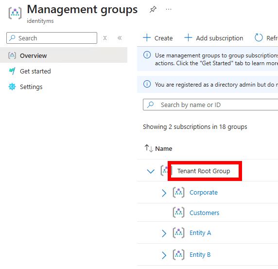

# Deploy Azure Governance Visualizer

Source: https://github.com/JulianHayward/Azure-MG-Sub-Governance-Reporting/blob/master/setup/console.md

## Prerequisites

- [Git](https://git-scm.com/downloads)
- [PowerShell 7](https://github.com/PowerShell/PowerShell#get-powershell) (minimum supported version 7.0.3)
- [Azure PowerShell](https://learn.microsoft.com/powershell/azure/install-azure-powershell), specifically `Az.Accounts`.
- [AzAPICall](https://github.com/JulianHayward/AzAPICall#get--set-azapicall-powershell-module)
- Azure Key Vault (Vault) to store the secret of your SP


## Set up a service principal

You can also use your admin account, but for stuff like this (automation for Ops or audit activities) it is preferable to use a SP.
We will run it through a service principal.

### Manually
Create your service principla and add these permissions:
- Application.Read.All
- Group.Read.All
- User.Read.All
- PrivilegedAccess.Read.AzureResources

To find API permission, go to Merill website (https://graphpermissions.merill.net)
<p align="center" width="100%">
    
</p>


### Script
I have created a script which will create a service principal, generate a secret and store it to a Key Vault.

```
.\Create-SP-with-secret.ps1 -TenantID "<tenantid>" -Name "sp-AzGovVisualizer" -VaultName "AzGovernance" -AccountUPN "mathias.dumont@contoso.com"

```


## Add reader permissions in Azure to your service principal
Be sure you have the permissions.
John Savill publish a video to recommend disabling Entra ID option bellow.
<p align="center" width="100%">
    
</p>
Video from John Savill: https://www.youtube.com/watch?v=Yq6RbGrQRok

In Azure, you could not be able to assign permissions on the Root Management Group.
<p align="center" width="100%">
    
</p>

If you have not defined a group on the Root or assigned someone, you have to enable this option.
Take time to implement RBAC:
- Create a group
- Assign permission (User Access Administrator)
- Move this group to A Restricted Admin Unit
- People will be able to request access

<p align="center" width="100%">
    
</p>

<p align="center" width="100%">
    
</p>

Now, I can give access to my SP

<p align="center" width="100%">
    
</p>


```
$objectId = "<objectId of the identity that will execute Azure Governance Visualizer>"
$managementGroupId = "<managementGroupId>"

New-AzRoleAssignment `
-ObjectId $objectId `
-RoleDefinitionName "Reader" `
-Scope /providers/Microsoft.Management/managementGroups/$managementGroupId
```


## Clone the Azure Governance Visualizer repository

Be sure you have Git installed.
```
git clone "https://github.com/JulianHayward/Azure-MG-Sub-Governance-Reporting.git"
Set-Location "Azure-MG-Sub-Governance-Reporting"
```

<p align="center" width="100%">
    
</p>


## Connect to Azure

```
$pscredential = Get-Credential -UserName "<sp id>"
Connect-AzAccount -ServicePrincipal -TenantId "<tenantid>" -Credential $pscredential
```

<p align="center" width="100%">
    
</p>


## Run

```
.\pwsh\AzGovVizParallel.ps1 -ManagementGroupId "<tenantid>" -OutputPath ".\AzGovViz-Output" -SubscriptionId4AzContext "<your sub>"
```

```
Set-Location -Path "c:\AzGovViz-Output"
Get-ChildItem
Invoke-Item ".\AzGovViz*.html"
```


## Result

<p align="center" width="100%">
    
</p>


📍Keep in mind your data are stored locally.
