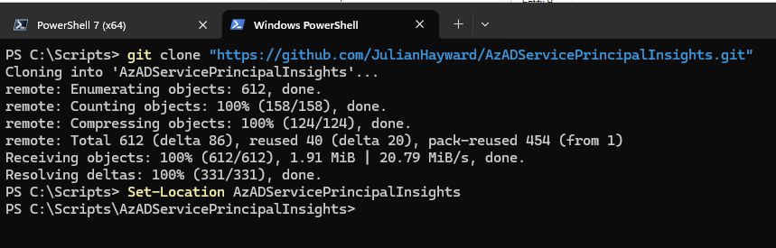

# Deploy Azure Service Principal Insights

Source: https://github.com/JulianHayward/AzADServicePrincipalInsights

## Overview
The Azure ServicePrincipal Insights project provides scripts and instructions to gain insights into Azure Service Principals. It helps in managing and visualizing service principal data.

## Prerequisites

- [Git](https://git-scm.com/downloads)
- [PowerShell 7](https://github.com/PowerShell/PowerShell#get-powershell) (minimum supported version 7.0.3)
- [Azure PowerShell](https://learn.microsoft.com/powershell/azure/install-azure-powershell), specifically `Az.Accounts`.
- [AzAPICall](https://github.com/JulianHayward/AzAPICall#get--set-azapicall-powershell-module)
- Azure Key Vault (Vault) to store the secret of your SP


## Set up a service principal

You can also use your admin account, but for tasks like this (automation for Ops or audit activities) it is preferable to use a SP.
We will run it through a service principal. You can reuse the service principal used for Azure Governance Visualizer.

## Clone the Azure Governance Visualizer repository

Be sure you have Git installed.
```
git clone "https://github.com/JulianHayward/AzADServicePrincipalInsights.git"
Set-Location AzADServicePrincipalInsights
```

<p align="center" width="100%">
    
</p>


## Run

```
$pscredential = Get-Credential -UserName "a8c178f9-15fc-4f4b-9501-f98cf6a36116"
Connect-AzAccount -ServicePrincipal -TenantId "ee942b75-82c7-42bc-9585-ccc5628492d9" -Credential $pscredential
.\pwsh\AzADServicePrincipalInsights.ps1
```

Open the report
```
Set-Location -Path ".\AzADServicePrincipalInsights"
Get-ChildItem
Invoke-Item ".\AzADServicePrincipalInsights*.html"
```


## Result

<p align="center" width="100%">
    
</p>


📍Keep in mind your data are stored locally.
