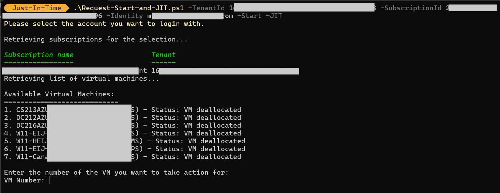
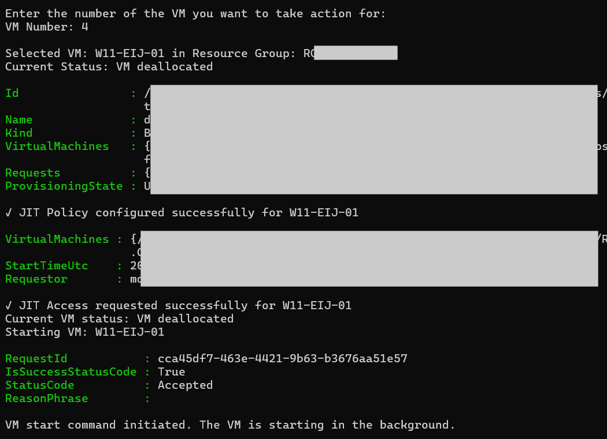
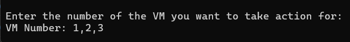

# Start and request JIT access

## Context

## Script Objective
This PowerShell script is designed to simplify the management of virtual machines (VMs) within an Azure subscription. It allows a user to authenticate their account, view available VMs, start a VM if it's stopped, and configure and initiate a Just-In-Time (JIT) access request to secure remote access (RDP).
Benefits

- Automation: Reduces time and human error by automating common VM management tasks.
- Security: Uses JIT to limit RDP port exposure, allowing access only from the user's public IP address and for a limited duration.
- Flexibility: Enables dynamic VM selection and independent activation of start and JIT options.
- Compatibility: Works with or without managed identity, depending on the parameters provided.

### How to Use

1. Prerequisites:

PowerShell Az module must be installed.
Sufficient permissions on the Azure subscription.

2. Script Parameters:TenantId (required): Azure tenant ID.
SubscriptionId (required): Azure subscription ID.
Identity (optional): Managed identity or specific user.
Start (optional): Starts the selected VM if it's stopped.
JIT (optional): Configures and initiates JIT access on RDP port (3389).

3. Execution:
```
.\Request-Start-and-JIT.ps1 -TenantId "xxxxxxxx-xxxx-xxxx-xxxx-xxxxxxxxxxxx" -SubscriptionId "xxxxxxxx-xxxx-xxxx-xxxx-xxxxxxxxxxxx" -Start -JIT
```

You will be prompted to choose a VM from the listed options. The script will then perform the requested actions.

<p align="center" width="100%">
    
</p>


<p align="center" width="100%">
    
</p>

If you want to start multiple VMs
<p align="center" width="100%">
    
</p>

### Expected Outcome:

If -Start is specified, the VM will be started if it's not already running.
If -JIT is specified, a JIT policy will be applied and an access request will be initiated to allow RDP access from your public IP for 4 hours.

### Additional Notes

The script uses Invoke-WebRequest to retrieve the user's public IP address.
If the PowerShell command for JIT fails, a REST API request is used as a fallback.
The script provides clear messages to guide the user throughout the process.
