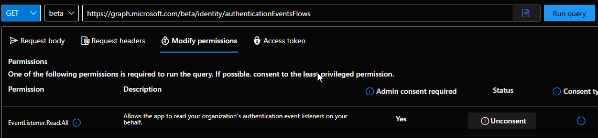
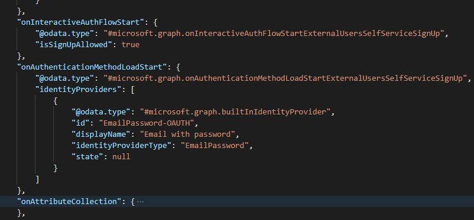
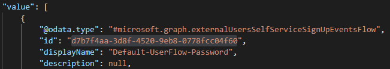
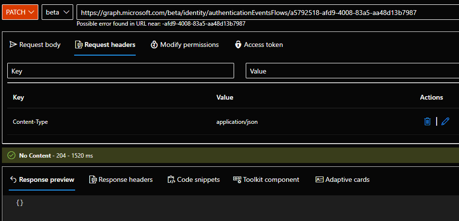
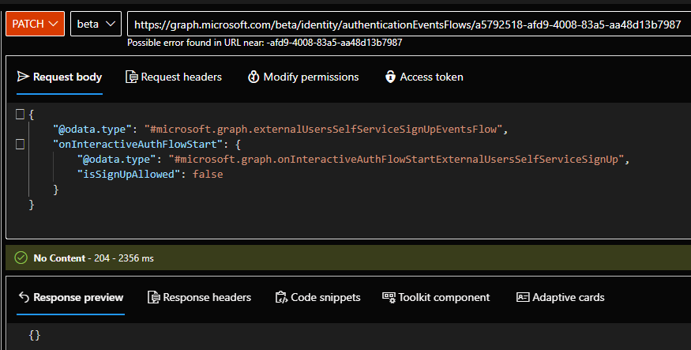
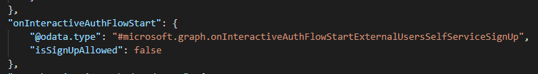

# How to disable SignUp flow in Entra External ID (external tenant)
By default, you can not disable the signup process through the portal. If you want to do that, you have to use Graph.

## Documentation
In Microsoft docuemntation, you will be to see that UserFlow doesn't exist, but authenticationEventsFlow exists.

https://learn.microsoft.com/en-us/graph/api/resources/authenticationeventsflow?view=graph-rest-beta

## List your authenticationEventsFlow

The first step consists to list all flows

    

For each flow, you can see the id, displayName, priority, idp, ...
As you can see, the SignUp process is true

    

To modify this value, you need to get the id of this authenticationEventsFlow

    

## Disable the SignUp
With the id, you will be able to PATCH the configuration

Add headers

    

Request body

    

    

Now, validate your configuration through a GET

    

