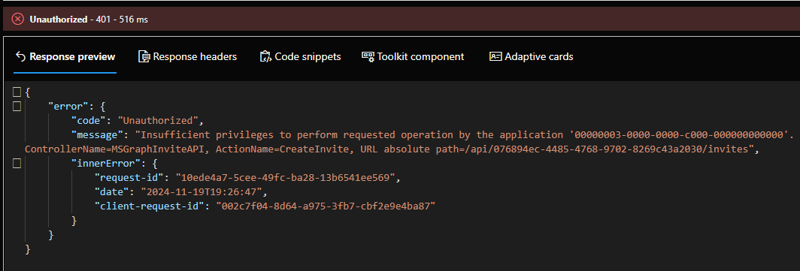

# Introduction
This platform is the new version and will replace in the future Azure AD B2C. Keep in mind AADB2C is still available and supported, but no future evolution is planned.

# User management


## Send an invite by Graph Explorer
The first scenario, the user has a mailbox.
The second one, the user has no mailbox.

### Scenario 1:
In this scenario, this user has an email address.

Information required:
- URL: https://graph.microsoft.com/v1.0/invitations
- Redirect URL: https://your-app.contoso.com

<p align="center" width="100%">
    
</p>

If you receive an permission error like this, add consent in Graph Explorer.
<p align="center" width="100%">
    
</p>

Go to Modify permissions and consent permission (User.Invite.All)
<p align="center" width="100%">
    
</p>

Then, you should receive a response like this.
<p align="center" width="100%">
    
</p>


### Scenario 2:
In this scenario, this user is an admin and doesn't have an email address.

Information required
```
{
  "invitedUserEmailAddress": "admin.security@contoso.onmicrosoft.com",
  "inviteRedirectUrl": "https://myapplications.microsoft.com/?tenantid=0000-00000-0000-0000-0000-0000000030",
  "sendInvitationMessage": false,
  "status": "Completed",
  "resetRedemption": false
}
```

### Validate the creation
Go back to Entra External ID and validate that user is created.
<p align="center" width="100%">
    
</p>


## User experience
User will receive this email.
<p align="center" width="100%">
    
</p>


Invite acceptation
<p align="center" width="100%">
    
</p>


### User experience (test)

Run a flow through interface (for admin)

or use this url after replacing those values:
- contosext by your tenant name (twice)
- AppId: AppId of your application
- RedirectURI: https%3A%2F%2Fjwt.ms

```
https://contosoext.ciamlogin.com/contosoext.onmicrosoft.com/oauth2/v2.0/authorize?client_id=<AppId>>&nonce=defaultNonce&redirect_uri=<redirectURI>&scope=openid+profile&response_type=id_token&prompt=login
```


Redirection to Entra External ID
<p align="center" width="100%">
    
</p>


I entered my email address and then I need to provide my password
<p align="center" width="100%">
    
</p>

I'am redirected to JWT website and I get my token
1: Entra External ID manages the request
2: Entra ID managed the authentication
<p align="center" width="100%">
    
</p>


