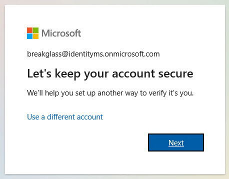
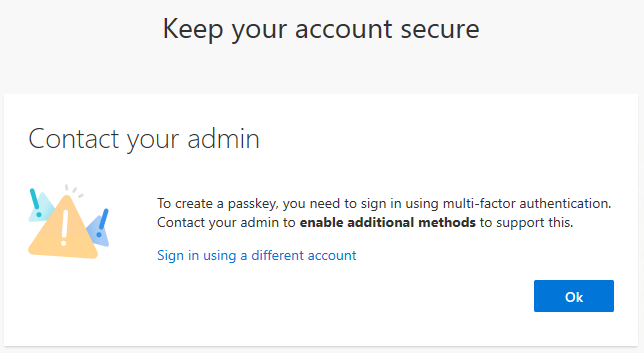
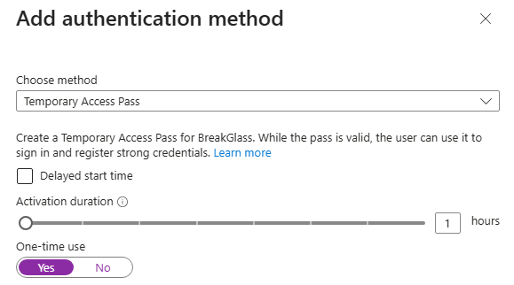
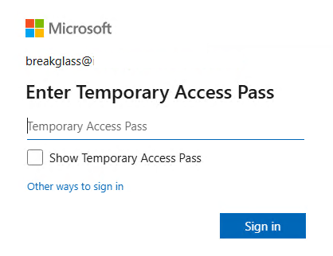
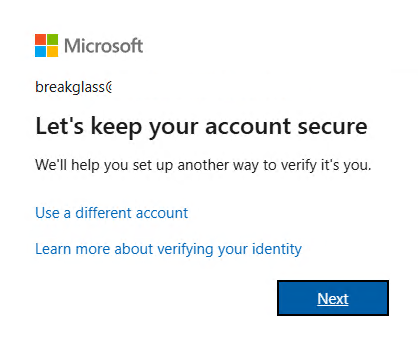
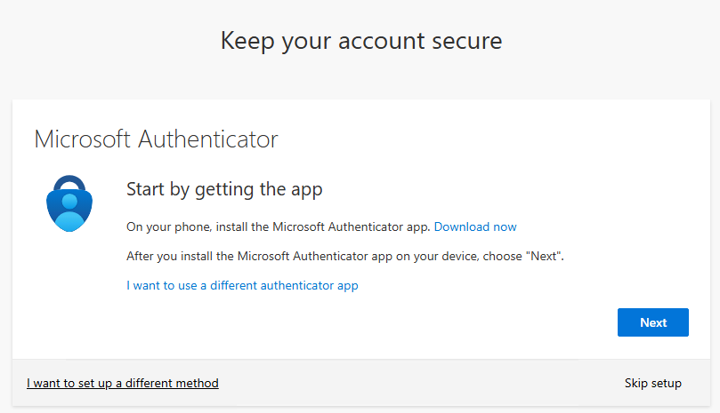

## my onmicrosoft.com account

After entering your password, you will be prompted to secure your account

To do that, you need to perform a MFA authentication.

Add a TAP

Go to the registration portal
https://aka.ms/mysecurityinfo

Enter the TAP

Secure your account

Skip Authenticator

