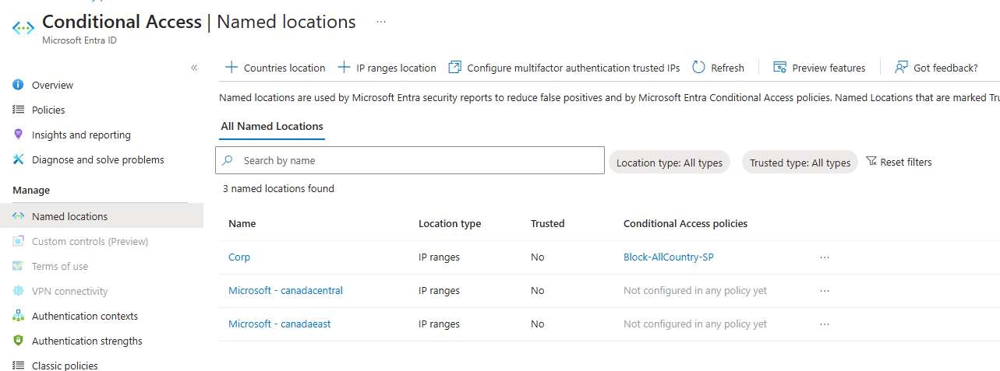
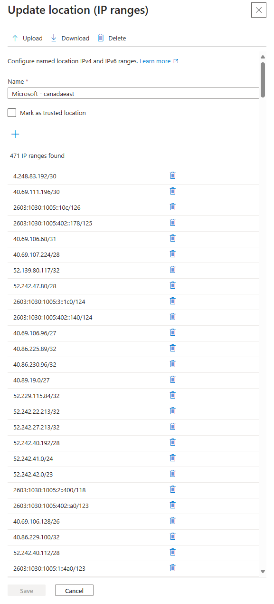

# Conditional Access Policies

Conditional Acces is your friend to protect your datas. That means you 

You can use Named Locations to define who can signin from, but you probably know the limitation:
- 195 named locations
- 2000 IP ranges per named location

https://learn.microsoft.com/en-us/entra/identity/conditional-access/concept-assignment-network#ipv4-and-ipv6-address-ranges


## IP ranges and services

Through this link, you can find IP ranges by region and services.
https://www.microsoft.com/en-us/download/details.aspx?id=56519&msockid=37496dfa52a3671839c07867532a6637


## The goal
Some organization have this specific requirement.
```
My users can not connect from outside Canada and I want my service principal can signin only from Microsoft Canada ips. How can I do that ?
```

## The script

This script downloads the file from MIcrosoft website, store it locally and then, create a named location with all IP ranges associated to the region you have defined.
By default, a location named "Microsoft - Entra ID" will be created for global services which includes:
- Entra ID
- Entra Domain Services
- Entra Service Endpoint

Here is an example:
```
.\Named-Location.ps1 -TenantId "ee942b75-82c7-42bc-9585-ccc5aaa123445567890" -daystocheck 7 -region canadaeast,canadacentral
```
- TenantId: Id of you tenant
- daystocheck: number of last days 
- regions: region you want to create


## Named Location in Entra ID

Here is an example of the result. Then, I can allow my Service Principal connecting from Canada East and Canada Central

<p align="center" width="100%">
    
</p>

<p align="center" width="100%">
    
</p>

## Use case
Now, I can use these locations to:
- Allow service principal signins from Canada East and Canada Central
- Allow users signin from my trusted locations and Canada East/Central

