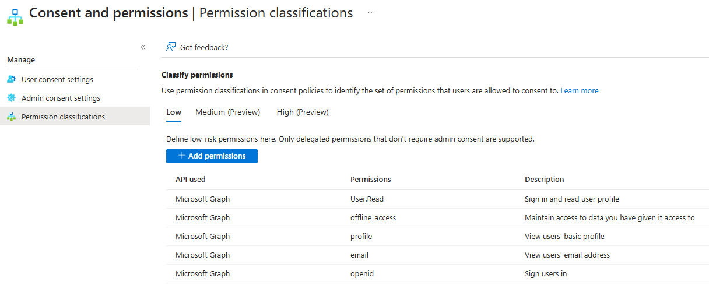
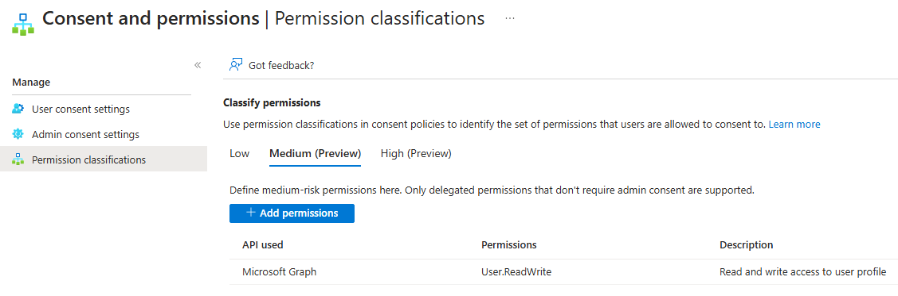
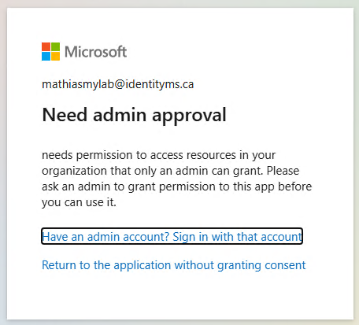
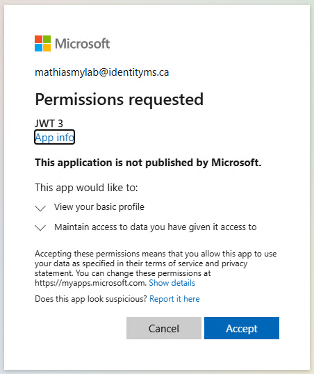
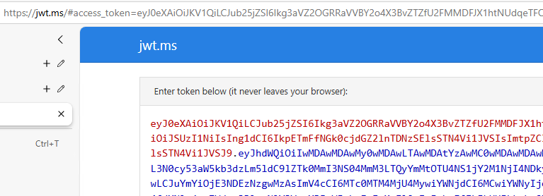
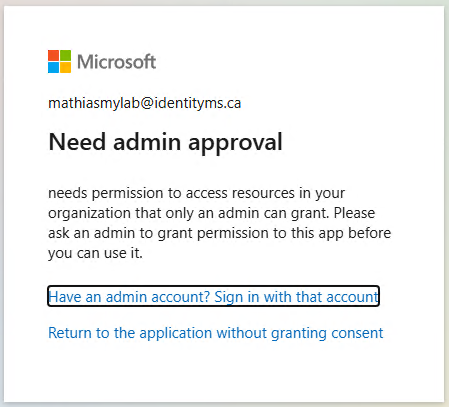
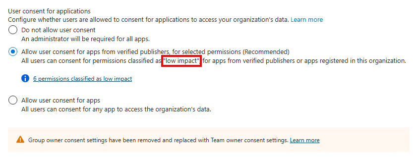

# Consent


## Configuration

### Low

<p align="center" width="100%">
    
</p>

### Medium

<p align="center" width="100%">
    
</p>


## Scope: openid + profile + group.read

Get token with this scope:
- openid
- profile
- group.read

```
https://login.microsoftonline.com/<tenantid>/oauth2/v2.0/authorize?client_id=<clientid>&nonce=defaultNonce&redirect_uri=https%3A%2F%2Fjwt.ms&scope=openid+profile+group.read&response_type=token
```

<p align="center" width="100%">
    
</p>


## Scope: openid + profile

Get token with this scope:
- openid
- profile

```
https://login.microsoftonline.com/<tenantid>/oauth2/v2.0/authorize?client_id=<clientid>&nonce=defaultNonce&redirect_uri=https%3A%2F%2Fjwt.ms&scope=openid+profile&response_type=token
```
<p align="center" width="100%">
    
</p>

User was able to consent because this is an application I registered and scope match with my low permission definition.
<p align="center" width="100%">
    
</p>


## Scope: openid + profile + user.readwrite

Get token with this scope:
- openid
- profile
- user.readwrite
```
https://login.microsoftonline.com/<tenantid>/oauth2/v2.0/authorize?client_id=<clientid>&nonce=defaultNonce&redirect_uri=https%3A%2F%2Fjwt.ms&scope=openid+profile+user.readwrite&response_type=token
```

**Admin consent is required !!**

<p align="center" width="100%">
    
</p>

Only "low impact" is supported.

<p align="center" width="100%">
    
</p>


