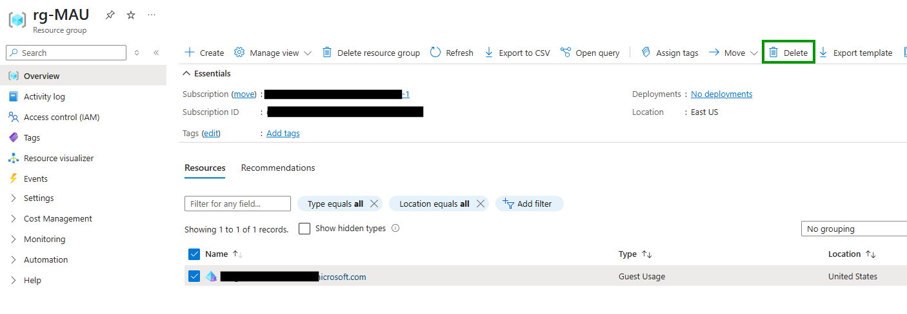

# Enable Monthly Active User

## Recommendation
Microsoft recommends to enable MAU to get benefits:
- you will be no longer limited to a 1:5 ratio
- first 50 000 MAU users are free
- you pay only for what you use
This apply to workforce tenant and external tenant.

## What means "Active" ?
"Active" means that a user made an authentication during the month.
For example:
- if you have 60 000 guest accounts, but only 1 000 guest account sign-in in your tenant, you will pay nothing.
- if you have 60 000 guest accounts and 55 000 guest account sign-in in your tenant, you will pay for 5 000 guest accounts.


# Enable MAU

## Register the resource provider in Azure
Install az module
```
Install-Module -Name Az -AllowClobber -Scope AllUsers -Force
```

Connect to Azure and register the resource provider
```
Connect-AzAccount
Register-AzResourceProvider -ProviderNamespace Microsoft.AzureActiveDirectory
```

Create a Resource Group
```
az group create --name rg-MAU --location eastus
```

## Link to the subscription

Here is the script

```
$tenantName = "MngEnvMCAP073183.onmicrosoft.com"
$tenantId = "68c000e5-9b6e-44c0-9820-f1bb07ce0cdb"
$subscriptionId="dcc4eb0c-127a-4a3a-a787-505f072cb493"
$resourceGroup="rg-MAU"
$locationName="United States"

az rest --method put --url https://management.azure.com/subscriptions/$subscriptionId/resourceGroups/$resourceGroup/providers/Microsoft.AzureActiveDirectory/guestUsages/${tenantName}?api-version=2020-05-01-preview --body "{'location': '$locationName', 'name': '$tenantName', 'type': 'Microsoft.AzureActiveDirectory/GuestUsages', 'properties': {'tenantId': '$tenantId'}}"

```
Source: https://learn.microsoft.com/en-us/entra/external-id/external-identities-pricing#link-your-azure-ad-tenant-to-a-subscription


# Disable MAU

Very easy :)
Delete the “Guest usage” resource type with your domain name.

<p align="center" width="100%">
    
</p>


