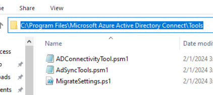
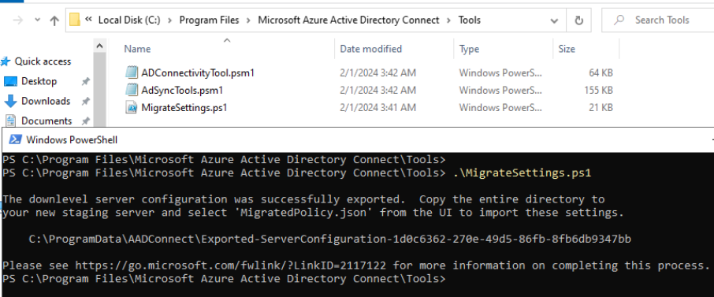
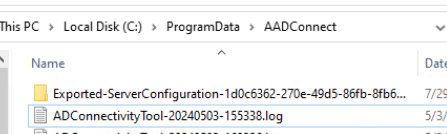
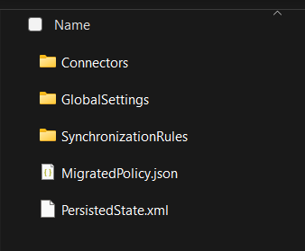
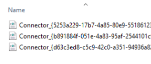
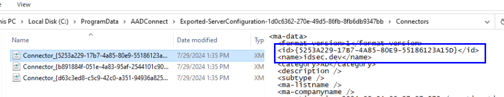
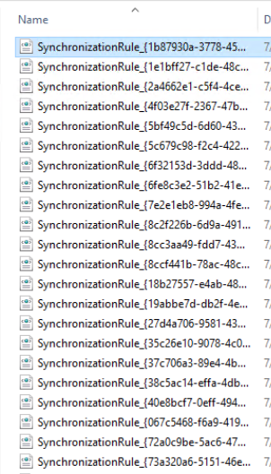
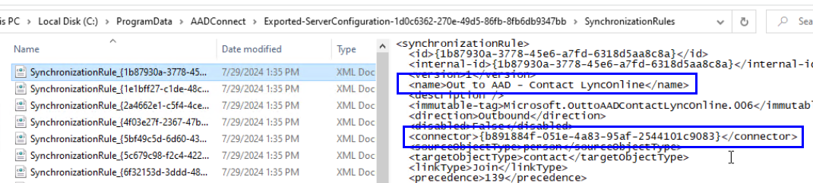
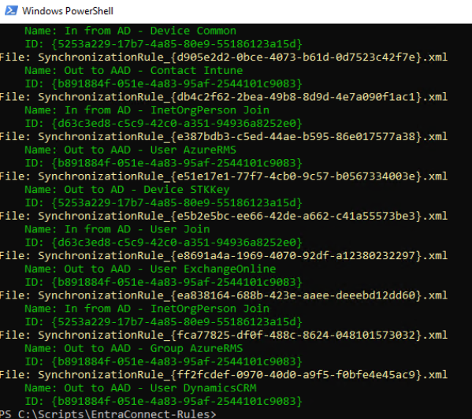
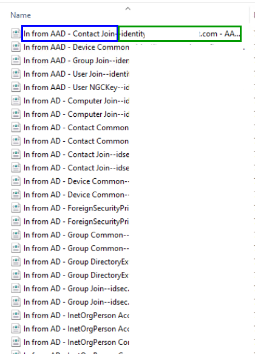

# EntraConnect-XML-Renamer


## Extract your configuration

1. Go to **"C:\Program Files\Microsoft Azure Active Directory\Tools"**. This tool is available by default.
<p align="center" width="100%">
     
</p>

2. Run the **MigrationSettings.ps1** script
<p align="center" width="100%">
     
</p>

3. Validate in this directory that a new folder starting by **"Exported-ServerConfiguration-"** exists.
<p align="center" width="100%">
     
</p>

## What's in this directory?

1. In this folder, here is what you should see.
<p align="center" width="100%">
     
</p>

2. Folder "Connectors"
<p align="center" width="100%">
     
</p>

Each file contains the id and the name of the connector. We need this information to identify where the synchronization rule is applied.
<p align="center" width="100%">
     
</p>

3. Folder "Synchronization"
<p align="center" width="100%">
     
</p>

Each file contains the name and id of the connector id. We need this information to identify the connector.
<p align="center" width="100%">
     
</p>

## Run the script
As you can see, it's not very easy to find the rule you want for troubleshooting or for comparing 2 configurations.
The purpose of this script is to help you by renaming the file to include the name of the rule and the connector.

1. Run the script
```
.\EntraConnect-XML-Renamer.ps1 -Folder "C:\.....\Exported-ServerConfiguration-454e78e1-cd3e-4122-8bae-9cedd2f6b5ae"
```

2. During execution
<p align="center" width="100%">
     
</p>

3. Now, I'm able to identify rules very quickly 😊
<p align="center" width="100%">
     
</p>

