# Use Managed Identity across tenant
Managed Identity is a powerful feature in Azure that allows you to securely access resources without managing credentials. In this guide, we will demonstrate how to use a User Assigned Managed Identity to read users in a target tenant from your main tenant.
In my scenario, from my main tenant, I use an Automation Account with a User Assigned Managed Identity to count users in my external tenant (formerly Azure AD B2C).

## Architecture

<p align="center" width="100%">
    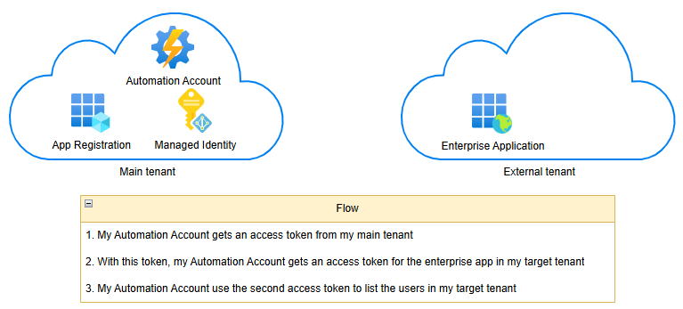
</p>


## Create a Managed Identity in your main tenant

1. Go to Azure portal and search **Managed Identity**
<p align="center" width="100%">
    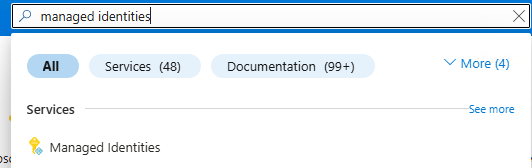
</p>

2. Create a new one
3. Fill the fields
<p align="center" width="100%">
    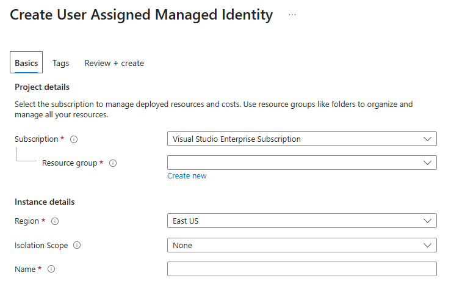
</p>

4. Review and create


## Create an App Registration in your main tenant

1. Define a name
2. Check multi-tenant
3. Click on Register
<p align="center" width="100%">
    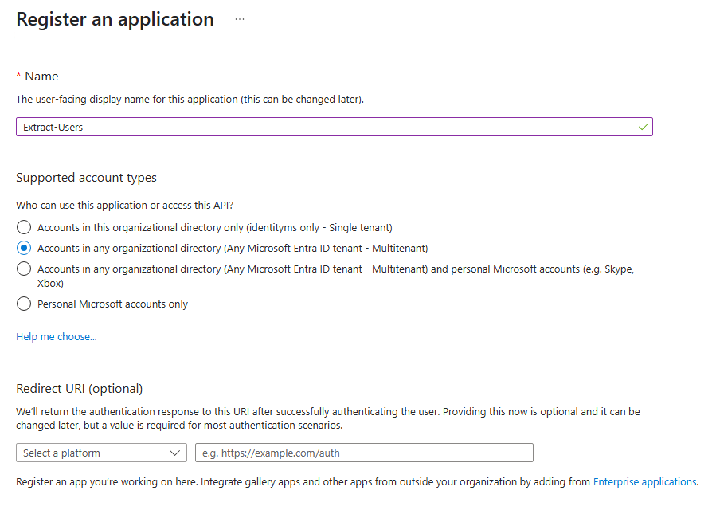
</p>

4. Assign permissions (User.Read.All)
<p align="center" width="100%">
    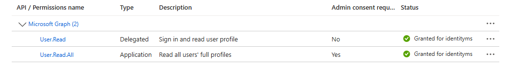
</p>

5. Add Federated Credentials and select **Managed Identity**
<p align="center" width="100%">
    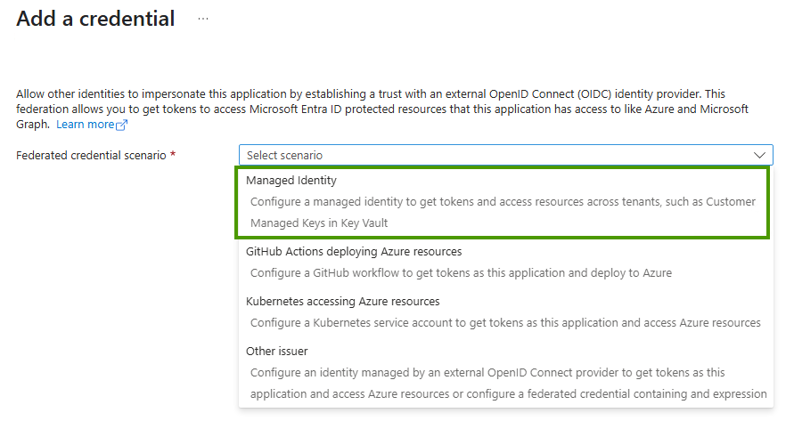
</p>

<p align="center" width="100%">
    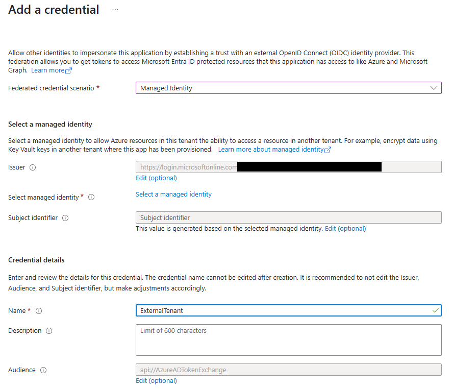
</p>

<p align="center" width="100%">
    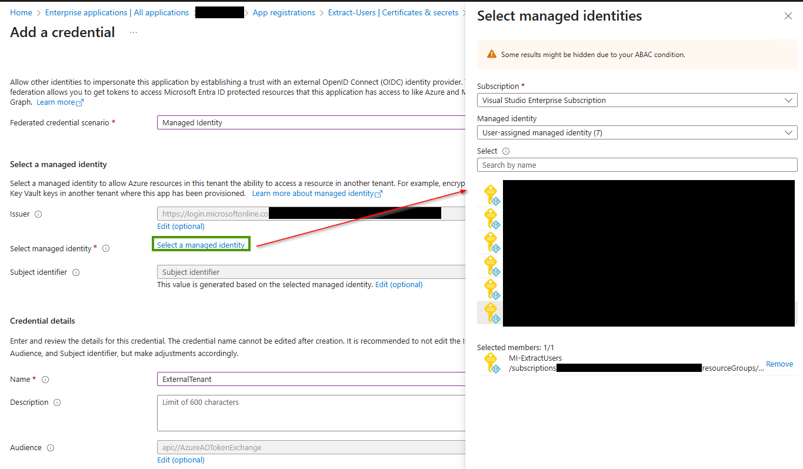
</p>


## Create an Enterprise Application in your target tenant

1. Get the Application ID (client ID) of your App Registration
2. Go to your other tenant to consent the application
https://login.microsoftonline.com/<tenantid>/adminConsent?client_id={client id of the app registration}

<p align="center" width="100%">
    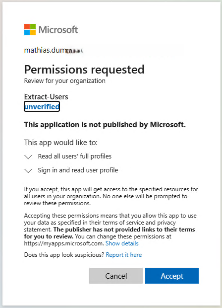
</p>

You will get this error
<p align="center" width="100%">
    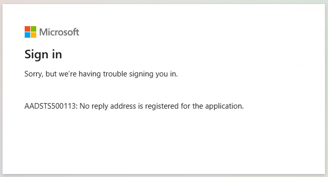
</p>


## Use the Managed Identity with Automation Account

<p align="center" width="100%">
    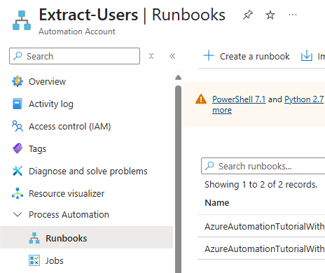
</p>

1. Create a runbook
<p align="center" width="100%">
    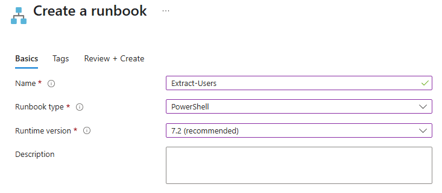
</p>

2. Define a name, select the type and runtime version
<p align="center" width="100%">
    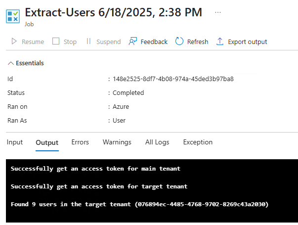
</p>


### The code

```
# Client Id of the user assigned identity
$UMI = "<your-value>"
 
# Client Id of the app registration in your main tenant
$AppRegIdMainTenant = "<your-value>"
 
# Tenant Id of your main tenant
$MainTenantId = "<your-value>"
 
# Tenant Id of the resource tenant you want to access
$TargetTenantId = "<your-value>"
 
# Get an Access Token for the User Assigned Identity in the Main Tenant
$AccessToken = Invoke-RestMethod $env:IDENTITY_ENDPOINT -Method 'POST' -Headers @{
    'Metadata'          = 'true'
    'X-IDENTITY-HEADER' = $env:IDENTITY_HEADER
} -ContentType 'application/x-www-form-urlencoded' -Body @{
    'resource'  = 'api://AzureADTokenExchange'
    'client_id' = $UMI
}
if(-not $AccessToken.access_token) {
    Write-Output "Failed to get an access token"
} else {
    Write-Output "Successfully get an access token for main tenant"
}

# Get an Access Token for the Target Tenant using the App Registration in the Main Tenant
$AccessTokenTargetTenant = Invoke-RestMethod "https://login.microsoftonline.com/$TargetTenantId/oauth2/v2.0/token" -Method 'POST' -Body @{
    client_id             = $AppRegIdMainTenant
    scope                 = 'https://graph.microsoft.com/.default'
    grant_type            = "client_credentials"
    client_assertion_type = "urn:ietf:params:oauth:client-assertion-type:jwt-bearer"
    client_assertion      = $AccessToken.access_token
}
 
if(-not $AccessTokenTargetTenant.access_token) {
    Write-Output "Failed to get an access token"
} else {
    Write-Output "Successfully get an access token for target tenant"
}

# Use the access token to call the Microsoft Graph API in the target tenant
$Result = Invoke-RestMethod -Uri "https://graph.microsoft.com/v1.0/users?`$top=999" -Headers @{
    Authorization = "Bearer $($AccessTokenTargetTenant.access_token)"
} | Select-Object -Exp Value | Measure-Object
Write-Output "Found $($Result.Count) users in the target tenant ($TargetTenantId)"
```

4. Run it and read the result

<p align="center" width="100%">
    
</p>


By following these steps, you can effectively use Managed Identity to access resources across tenants, enhancing security and simplifying identity management.

Feel free to ask if you need more specific changes or additional help!

Sources:
- https://learn.microsoft.com/en-us/azure/app-service/overview-managed-identity?tabs=portal%2Cpowershell#connect-to-azure-services-in-app-code
- https://learn.microsoft.com/en-us/entra/identity/managed-identities-azure-resources/how-to-use-vm-token
- https://learn.microsoft.com/en-us/entra/identity-platform/v2-oauth2-client-creds-grant-flow#third-case-access-token-request-with-a-federated-credential
- https://learn.microsoft.com/en-us/entra/workload-id/workload-identity-federation
- https://learn.microsoft.com/en-us/entra/workload-id/workload-identity-federation-config-app-trust-managed-identity?tabs=microsoft-entra-admin-center%2Cdotnet