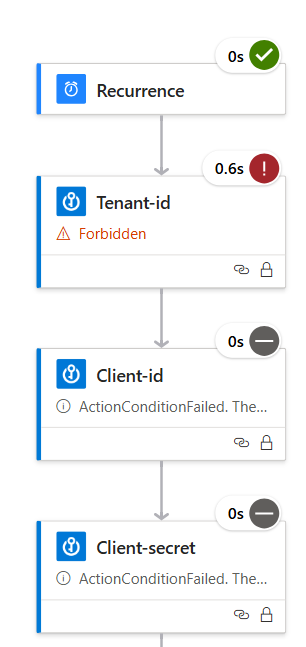
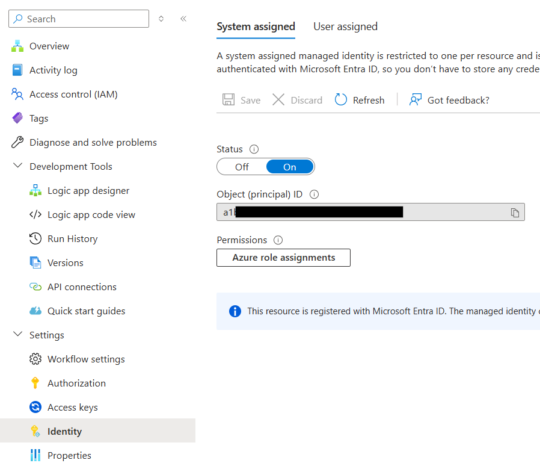

# Deployment

Deploy through 2 steps:

1. Deploy the ARM template in your subscription
2. Go to the connectors (O365 and Key Vault), and Authorize them

After deployment, you need to give permission to your Managed Identity on your KeyVault.

    

Find objectid of MI

    

Give permission 

## Deployment template

You can deploy the ARM templates to your Azure Subscription using the link below:

