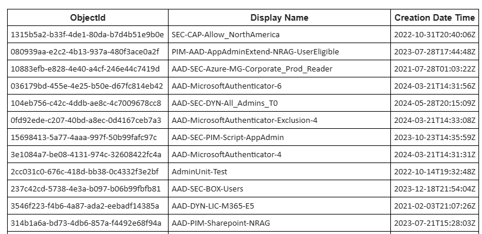

# List all groups and get empty groups with Logic App


I'm not a big fan of PowerShell script running on server, but I need to monitor my groups.
This Logic App get all groups and if a group exist more than 180 days and there is no member, I want to be notified one time per month.

I reuse my previous logic app to send notification.


## Prerequisites

### Logic App for notification
This Logic App is designed to call another Logic App, currently without email notification functionality.
To create this Logic App, follow the instructions here 👉 [README file](../Notifications/README.md).

## Deployment

Deploy the ARM template in your subscription and fill all the fields
- Resource Group
- Location
- Logic App Name
- Logic App Notification
- Frequency / Interval (See the documentation below)
https://learn.microsoft.com/en-us/azure/connectors/connectors-native-recurrence?tabs=consumption
- Mail from
- Mail Report
- Threshold


### Deployment template

You can deploy the ARM templates to your Azure Subscription using the link below:

<a href="https://portal.azure.com/#create/Microsoft.Template/uri/https%3A%2F%2Fraw.githubusercontent.com%2FMathiasMSFT%2FMyWiki%2Frefs%2Fheads%2Fmain%2FLogic-App%2FList%20empty%20groups%2Fazuredeploy.json" target="_blank">
  
</a>

You should see a failed run and that's normal because your Managed Identity doesn't have any permissions.


## After deployment

### Permissions on Managed Identity
Then, you need to give permissions to your Managed Identity:
- read groups

Use the script below. Replace values by your own
```
$TenantID = "<tenantid>"
$GraphAppId = "00000003-0000-0000-c000-000000000000"
$DisplayNameMI = "<name of your Logc App>"
$GraphPermissions = @('Group.Read.All')

Connect-MgGraph -Scopes Application.Read.All,AppRoleAssignment.ReadWrite.All -TenantId $TenantID

$IdMI = Get-MgServicePrincipal -Filter "DisplayName eq '$DisplayNameMI'"

## Get assigned roles
Get-MgServicePrincipalAppRoleAssignment -ServicePrincipalId $IdMI.Id

ForEach ($GraphPermission in $GraphPermissions) {
    ## Get Graph roles
    $GraphServicePrincipal = Get-MgServicePrincipal -Filter "appId eq '$GraphAppId'"
    $AppRole = $GraphServicePrincipal.AppRoles | Where-Object {$_.Value -eq $GraphPermission -and $_.AllowedMemberTypes -contains "Application"}

    $AppRole

    $params = @{
        principalId = $IdMI.Id
        resourceId = $GraphServicePrincipal.Id
        appRoleId = $AppRole.Id
    }

    ## Add permission to Managed Identity 
    New-MgServicePrincipalAppRoleAssignment -ServicePrincipalId $params.principalId -ResourceId $params.resourceId -PrincipalId $params.principalId -AppRoleId $params.appRoleId
}

## Get assigned roles
Get-MgServicePrincipalAppRoleAssignment -ServicePrincipalId $IdMI.Id
```

## Run the logic app

Run your Logic App and validate in "Run History" blade that it works correctly.

<p align="center" width="100%">
    
</p>

