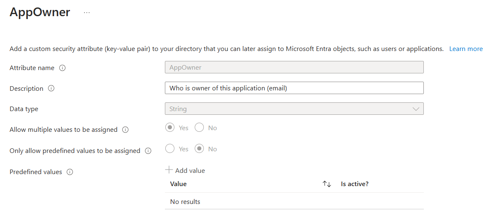

# Monitorer vos secrets et certificats de vos applications
[](README.md)

## Prérequis

### Logic App for notification
Cette Logic App est conçue pour appeler une autre Logic App, sans fonctionnalité de notification par e-mail pour le moment. Pour créer ce Logic App, suivez les instructions ici 👉 [README file](../Notifications/README.md).

### Custom Security Attributes
Custom Security Attributes (CSA) ne sont pas de simples attributs. Par défaut, les membres de Global Admin ne disposent d'aucune autorisation pour les gérer.  La création de "set" et d' "attributes" (CSA) nécessite des rôles que vous devez gérer via PIM (Privileged Identity Management):
- Attribute Definition Administrator or Reader
- Attribute Assignment Administrator or Reader

Dans ce cas, j'ai créé un set nommé "OwnerManagement". Dans ce set, j'ai créé un attribut nommé "AppOwner" qui stockera tous les propriétaires de mes applications.

<p align="center" width="100%">
    
</p>

<p align="center" width="100%">
    
</p>

<p align="center" width="100%">
    
</p>

**Important:** Une fois créés, vous ne pouvez pas supprimer un CSA, vous ne pouvez que le désactiver.

📍 Si vous souhaitez utiliser votre propre set et attributs, voici ce que vous devez mettre à jour dans le template :

Here are the lines you need to change:
- Line 279: OwnerManagement
- Line 284: AppOwner
- Line 290: AppOwner
- Line 334: OwnerManagement / AppOwner
- Line 371: OwnerManagement / AppOwner
- Line 443: OwnerManagement / AppOwner
- Line 570: OwnerManagement / AppOwner
- Line 576: OwnerManagement / AppOwner
- Line 664: OwnerManagement / AppOwner


## Déploiement
Déployer en 2 étapes:

1. Déployer le template ARM dans votre souscription et renseigner les champs:
- Resource Group
- Region
- Logic App Name
- Logic App Notification
- Frequency / Interval (See the documentation below)
https://learn.microsoft.com/en-us/azure/connectors/connectors-native-recurrence?tabs=consumption
- Mail from
- Mai Report
2. Assigner les permissions


### Déploiement du template

Vous pouvez déployer le template via le lien ci-dessous:

<a href="https://portal.azure.com/#create/Microsoft.Template/uri/https%3A%2F%2Fraw.githubusercontent.com%2FMathiasMSFT%2FMyWiki%2FLogic%20App%2FMonitor%20secret-certificate%2Fazuredeploy.json" target="_blank">
  
</a>

Vous devriez voir que l'éxecution a échoué et c'est normal car votre Managed Identity n'a pas de permissions.


## Après le déploiement

### Permissions sur votre Managed Identity
Ensuite, vous avez besoin d'attribuer les permissions à votre Managed Identity:
- lire les applications
- lire les Custom Security Attributes

1. Trouver l'objectid de votre MI
<p align="center" width="100%">
    
</p>

2. Utiliser le script ci-dessous et remplacer les valeurs par les vôtres
```
$TenantID = "<tenantid>"
$GraphAppId = "00000003-0000-0000-c000-000000000000"
$DisplayNameMI = "<name of your Logc App>"
$GraphPermissions = @('CustomSecAttributeAssignment.Read.All','Application.Read.All')

Connect-MgGraph -Scopes Application.Read.All,AppRoleAssignment.ReadWrite.All -TenantId $TenantID

$IdMI = Get-MgServicePrincipal -Filter "DisplayName eq '$DisplayNameMI'"

## Get assigned roles
Get-MgServicePrincipalAppRoleAssignment -ServicePrincipalId $IdMI.Id

ForEach ($GraphPermission in $GraphPermissions) {
    ## Get Graph roles
    $GraphServicePrincipal = Get-MgServicePrincipal -Filter "appId eq '$GraphAppId'"
    $AppRole = $GraphServicePrincipal.AppRoles | Where-Object {$_.Value -eq $GraphPermission -and $_.AllowedMemberTypes -contains "Application"}

    $AppRole

    $params = @{
        principalId = $IdMI.Id
        resourceId = $GraphServicePrincipal.Id
        appRoleId = $AppRole.Id
    }

    ## Add permission to Managed Identity 
    New-MgServicePrincipalAppRoleAssignment -ServicePrincipalId $params.principalId -ResourceId $params.resourceId -PrincipalId $params.principalId -AppRoleId $params.appRoleId
}

## Get assigned roles
Get-MgServicePrincipalAppRoleAssignment -ServicePrincipalId $IdMI.Id
```

## Exécuter la logic app

Exécuter votre Logic App et vérifier dans la section "Historique des exécutions" qu'elle fonctionne correctement.

Les administrateurs ou l'équipe IGA recevront un e-mail contenant toutes les applications avec des secrets ou des certificats qui sont expirés (incluant les détails):
- Application Id
- Nom de l'application
- Key Id (secret id or certificate id)
- Depuis combien de jours le secret/certificat est expiré
- Email des propriétaires


Les propriétaires des applications recevront un e-mail pour chaque application contenant:
- Non de l'application
- Dans combien de jours le secret/certificat est expiré
- Key Id (secret id or certificate id)
- Date d'expiration
- Application Id

