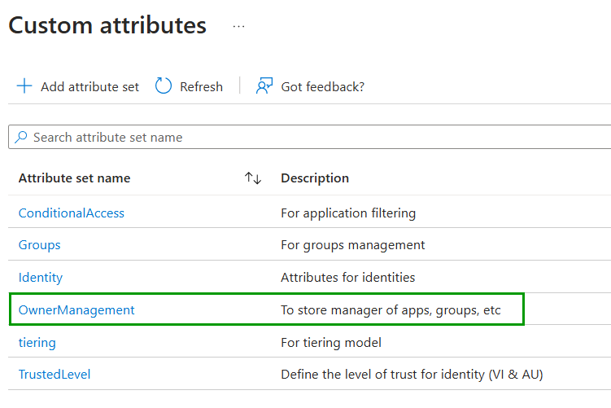
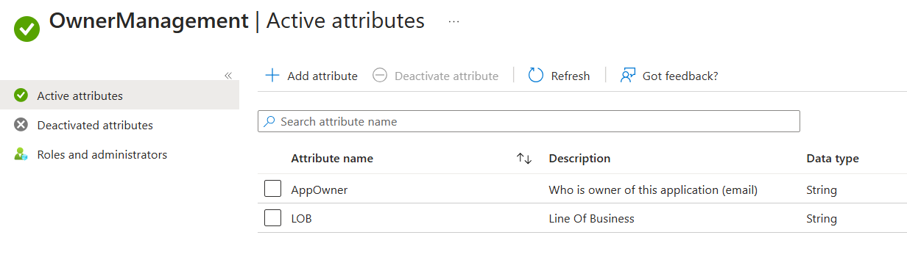
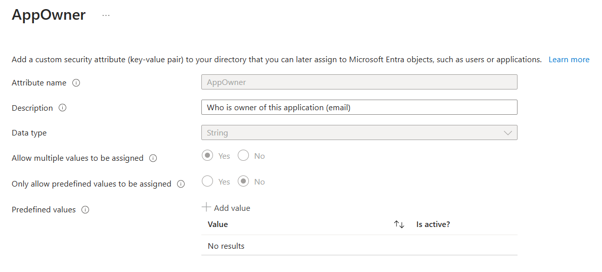
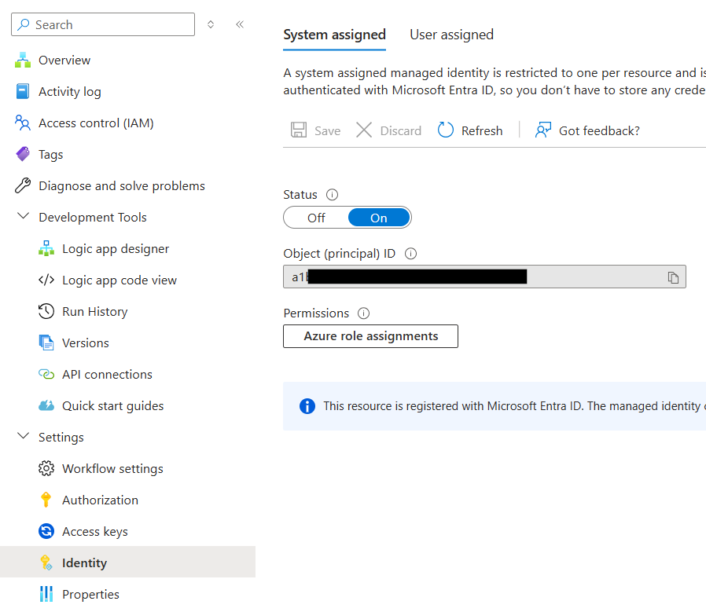

# Deployment

## Prerequisites

### Logic App for notification
This Logic App need to call another Logic App. Nothing is configure to send an email.
To create this Logic App, go here 👉 <a href="">Notifications</a>

### Custom Security Attributes
Custom Security Attributes are not simple attribute. By default, Global Admin members don't have amy permissions. Creating sets and attributes require roles that you have to manage by PIM.
- Attribute Definition Administrator or Reader
- Attribute Assignemnt Administrator or Reader

In this case, I have created a set named "OwnerManagement". In this set, I have created an attribute "AppOwner" which will store all owners of my applications.

<p align="center" width="100%">
    
</p>

<p align="center" width="100%">
    
</p>

<p align="center" width="100%">
    
</p>

⚠️ Keep in mind that you can not delete Custom Security Attribute, just disable them.

📍 If you would like to use your own Set and Custom Security Attribute, here is what you need to update in the template below:

Here are the line you need to change:
- Line 279: OwnerManagement
- Line 284: AppOwner
- Line 290: AppOwner
- Line 334: OwnerManagement / AppOwner
- Line 371: OwnerManagement / AppOwner
- Line 443: OwnerManagement / AppOwner
- Line 570: OwnerManagement / AppOwner
- Line 576: OwnerManagement / AppOwner
- Line 664: OwnerManagement / AppOwner


## Deployment
Deploy through 2 steps:

1. Deploy the ARM template in your subscription and fill all the fields
- Resource Group
- Region
- Logic App Name
- Logic App Notification
- Frequency / Interval (See the documentation below)
https://learn.microsoft.com/en-us/azure/connectors/connectors-native-recurrence?tabs=consumption
- Mail from
- Mai Report
2. Assign permissions


### Deployment template

You can deploy the ARM templates to your Azure Subscription using the link below:

<a href="https://portal.azure.com/#create/Microsoft.Template/uri/https%3A%2F%2Fraw.githubusercontent.com%2FMathiasMSFT%2FScripts%2FLogic%20Apps%2FMonitor%20secret-certificate%2Fazuredeploy.json" target="_blank">
  
</a>

You should see a failed run and that's normal because your Managed Identity doesn't have any permissions.
Follow next step 👇


## After deployment

### Permissions on Managed Identity
Then, you need to give permissions to your Managed Identity:
- read applications
- read Custom Security Attributes

1. Find objectid of MI
<p align="center" width="100%">
    
</p>

2. Use the script below. Replace values by your own
```
$TenantID = "<tenantid>"
$GraphAppId = "00000003-0000-0000-c000-000000000000"
$DisplayNameMI = "<name of your Logc App>"
$GraphPermissions = @('CustomSecAttributeAssignment.Read.All','Application.Read.All')

Connect-MgGraph -Scopes Application.Read.All,AppRoleAssignment.ReadWrite.All -TenantId $TenantID

$IdMI = Get-MgServicePrincipal -Filter "DisplayName eq '$DisplayNameMI'"

## Get assigned roles
Get-MgServicePrincipalAppRoleAssignment -ServicePrincipalId $IdMI.Id

ForEach ($GraphPermission in $GraphPermissions) {
    ## Get Graph roles
    $GraphServicePrincipal = Get-MgServicePrincipal -Filter "appId eq '$GraphAppId'"
    $AppRole = $GraphServicePrincipal.AppRoles | Where-Object {$_.Value -eq $GraphPermission -and $_.AllowedMemberTypes -contains "Application"}

    $AppRole

    $params = @{
        principalId = $IdMI.Id
        resourceId = $GraphServicePrincipal.Id
        appRoleId = $AppRole.Id
    }

    ## Add permission to Managed Identity 
    New-MgServicePrincipalAppRoleAssignment -ServicePrincipalId $params.principalId -ResourceId $params.resourceId -PrincipalId $params.principalId -AppRoleId $params.appRoleId
}

## Get assigned roles
Get-MgServicePrincipalAppRoleAssignment -ServicePrincipalId $IdMI.Id
```

## Run the logic app

Run your Logic App and validate in "Run History" blade that your Logic App works.


