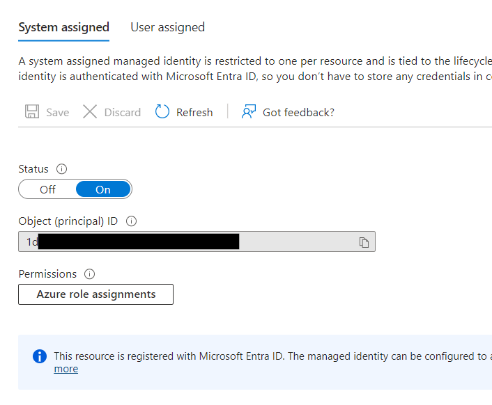
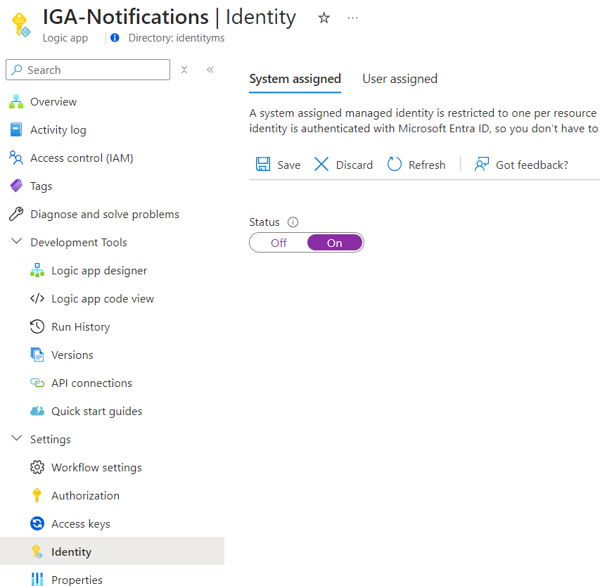
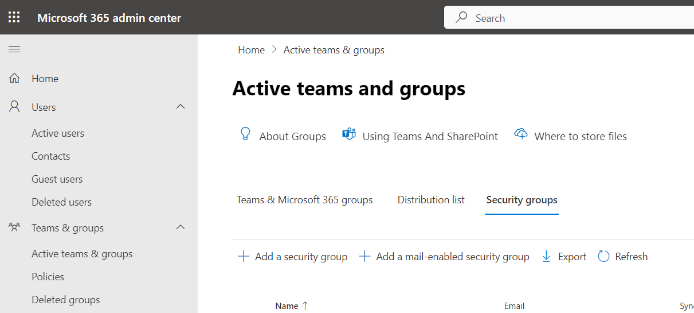
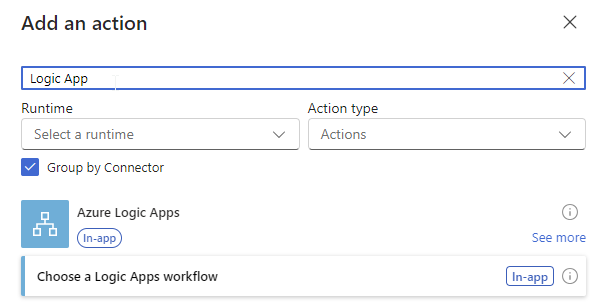
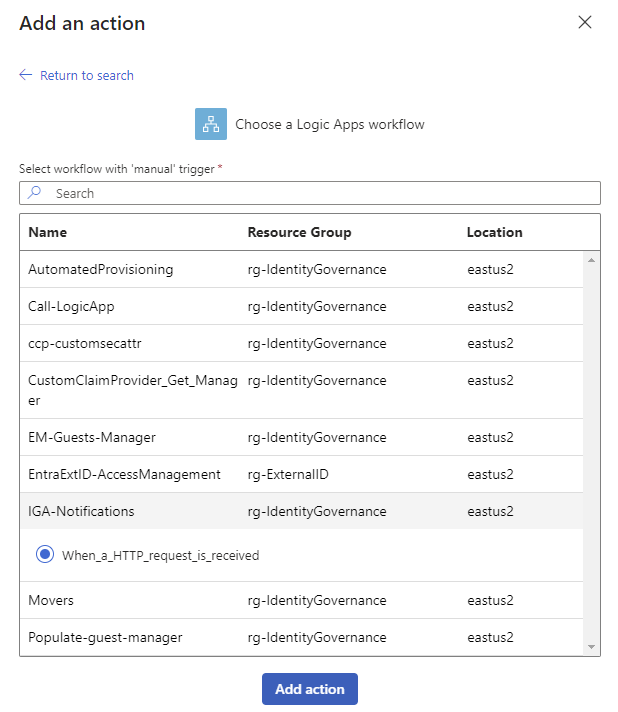
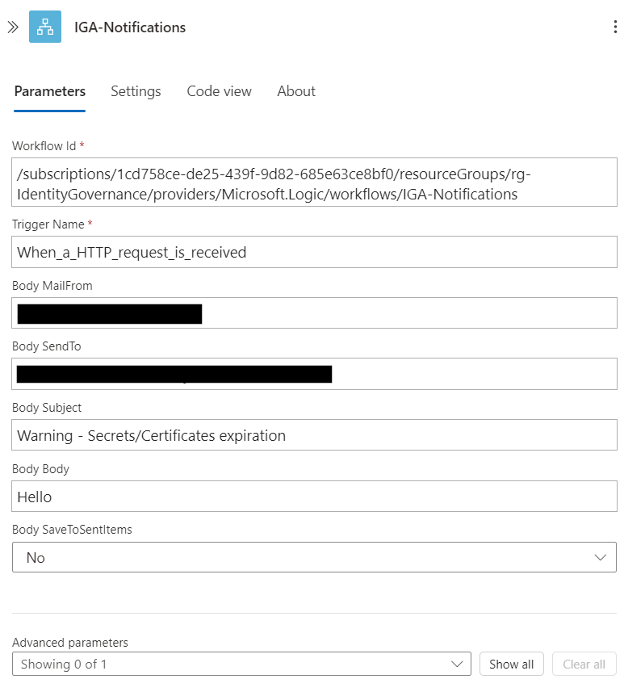

# How to manage notification with Logic App

You probably have some Logic App to monitor or analyze some workload with notification. In each your Logic App, you implement an action to send an email.
Do you know that you can call an nested Logic App ?
For example, you have a Logic App analysing secret or certificate of your application, and if a secret is expiring or has expired, you send an email to someone.
The goal is to call this Logic App everytime you need to send an email without implementing this in each Logic App.

Your Managed Identity needs Mail.Send permission, that means it will be able to send an email from anyone. To secure this part, you will use an Application Access Policy in Exchange Online to allow only this MI to send an email from only one mailbox.

## Create a Logic App Consumption

You can deploy the ARM templates to your Azure Subscription using the link below:

<a href="https://portal.azure.com/#create/Microsoft.Template/uri/https%3A%2F%2Fraw.githubusercontent.com%2FMathiasMSFT%2FMyWiki%2Fblob%2F8abcf3b1dae3473ca8925e033a8a8ab10b508fb4%2FLogic-App%2FNotifications%2Fazuredeploy-notifications.json" target="_blank">
  
</a>


## Create a Managed Identity

1. 
<p align="center" width="100%">
    
</p>

2. 
<p align="center" width="100%">
    
</p>


3. Assign permissions

```
$TenantID = "ee942b75-82c7-42bc-9585-ccc5628492d9"
$GraphAppId = "00000003-0000-0000-c000-000000000000"
$DisplayNameMI = "IGA-Notifications"
$GraphPermission = "Mail.Send"

Connect-MgGraph -Scopes Application.Read.All,AppRoleAssignment.ReadWrite.All

$IdMI = Get-MgServicePrincipal -Filter "DisplayName eq '$DisplayNameMI'"

## Get assigned roles
Get-MgServicePrincipalAppRoleAssignment -ServicePrincipalId $IdMI.Id

## Get Graph roles
$GraphServicePrincipal = Get-MgServicePrincipal -Filter "appId eq '$GraphAppId'"
$AppRole = $GraphServicePrincipal.AppRoles | Where-Object {$_.Value -eq $GraphPermission -and $_.AllowedMemberTypes -contains "Application"}

$AppRole

$params = @{
	principalId = $IdMI.Id
	resourceId = $GraphAppId
    appRoleId = $($AppRole.Id)
}

## Add permission to Managed Identity
New-MgServicePrincipalAppRoleAssignment -ServicePrincipalId $IdMI.Id -ResourceId $GraphServicePrincipal.Id -PrincipalId $IdMI.Id -AppRoleId $AppRole.Id

## Get assigned roles
Get-MgServicePrincipalAppRoleAssignment -ServicePrincipalId $IdMI.Id
```


4. Create an email account and add it in your group

5. Create a mail-enabled security group

Email: iga-notifications@mydomain.ca
<p align="center" width="100%">
    
</p>


6. Create an Application Access Policy in Exchange Online

- AppId: Application Id of your Mnanaged Identity
- PolicyScopeGroupId: email of your mail-enabled security group

```
# Install-Module ExchangeOnlineManagement
Connect-ExchangeOnline -UserPrincipalName mathias.dumont@identityms.onmicrosoft.com

New-ApplicationAccessPolicy `
    -AppId 46e8da3e-6eb9-4881-ab9c-bb010fd85f3f `
    -PolicyScopeGroupId iga-notifications@identityms.onmicrosoft.com `
    -AccessRight RestrictAccess `
    -Description "Restrict IGA-Notifications managed identity"
```


## Call this Logic App

In your main Logic App, use Logic App to call it.


<p align="center" width="100%">
    
</p>

<p align="center" width="100%">
    
</p>


<p align="center" width="100%">
    
</p>


https://learn.microsoft.com/en-us/azure/logic-apps/logic-apps-http-endpoint?tabs=consumption


## Troubleshooting

### Access to OData is disabled

Check your policy
<p align="center" width="100%">
    
</p>

https://learn.microsoft.com/en-us/graph/resolve-auth-errors#403-forbidden-access-to-odata-is-disabled

https://learn.microsoft.com/en-us/graph/auth-limit-mailbox-access#handling-api-errors

https://learn.microsoft.com/en-us/powershell/module/exchange/set-organizationconfig?view=exchange-ps#-EwsApplicationAccessPolicy

https://learn.microsoft.com/en-us/exchange/client-developer/exchange-web-services/how-to-control-access-to-ews-in-exchange#examples-controlling-access-to-ews


