# Enable Security Copilot for E5 customers

As announced at Ignite, Security Copilot is included in E5 licenses.

1. Go to https://securitycopilot.microsoft.com

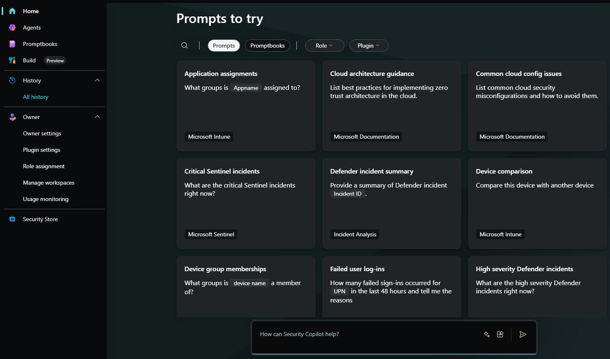

2. Go to Agents

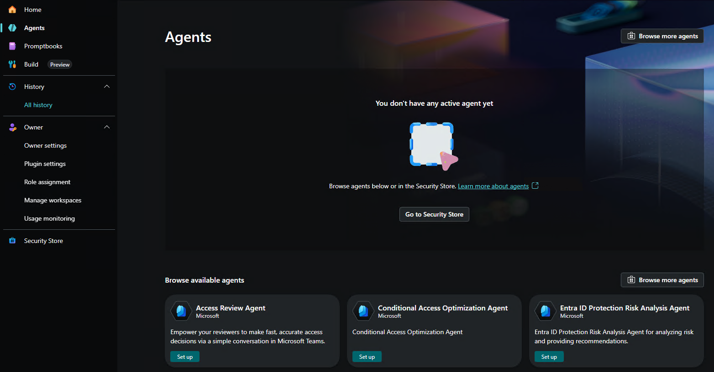

3. Enable agents

3.1. Conditional Access Optimization Agent

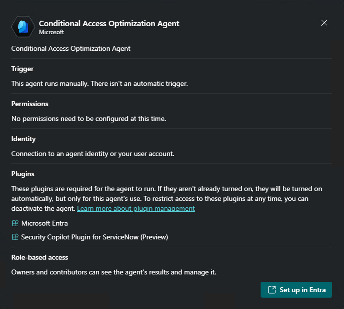

You will be redirected to Entra

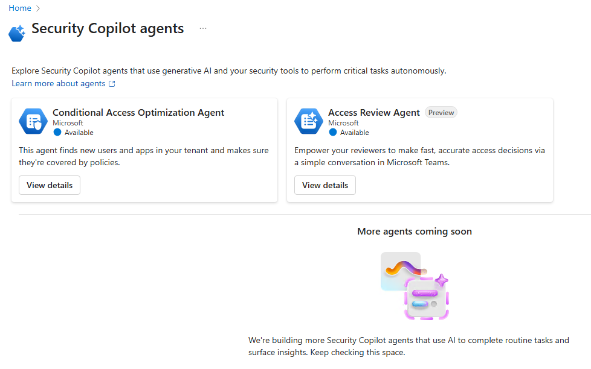

Click on **View details**

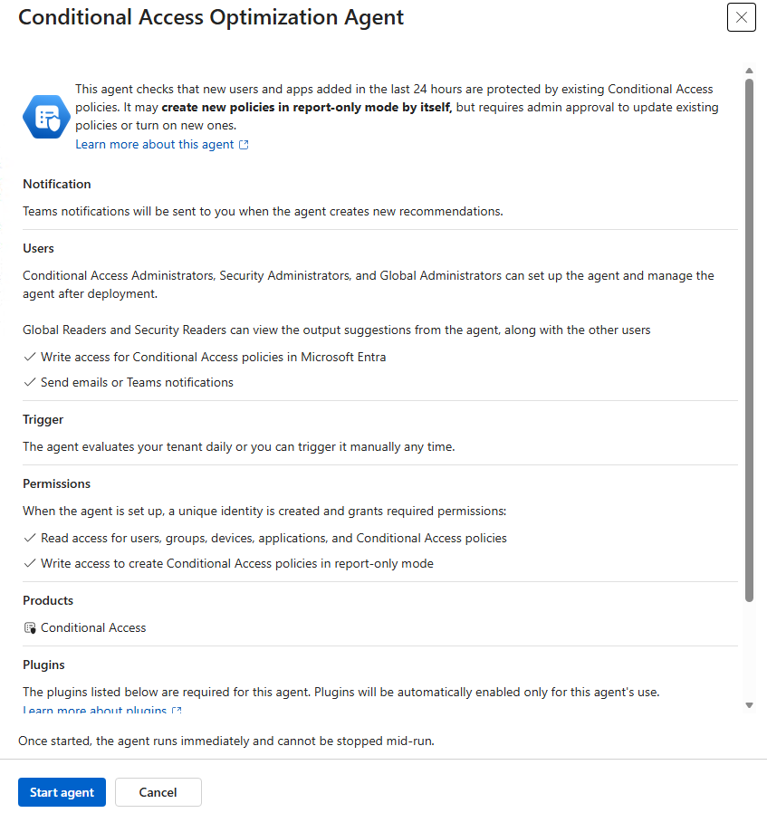

After creation, teh agent will run automatically.

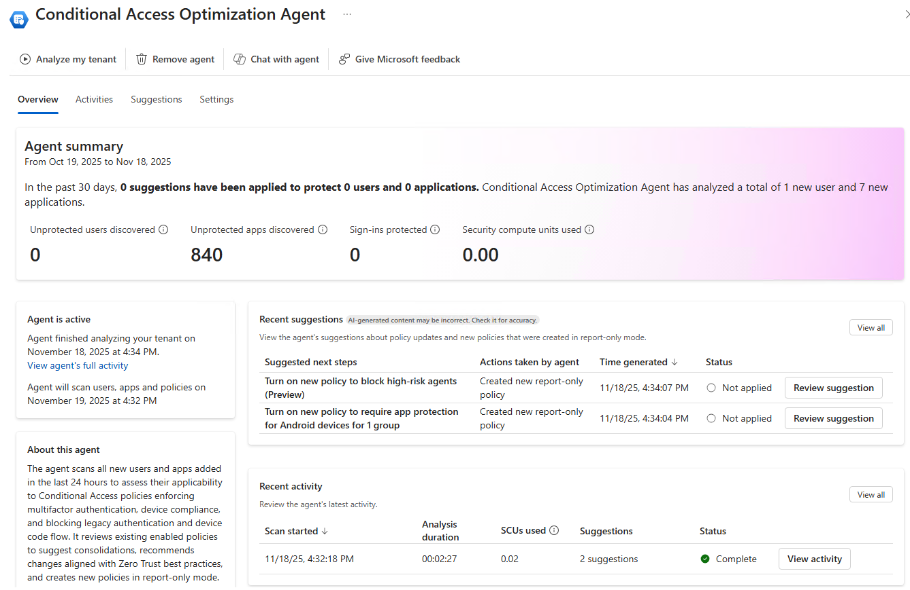

3.2. ID Protection Risk Analytics Agwent

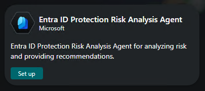

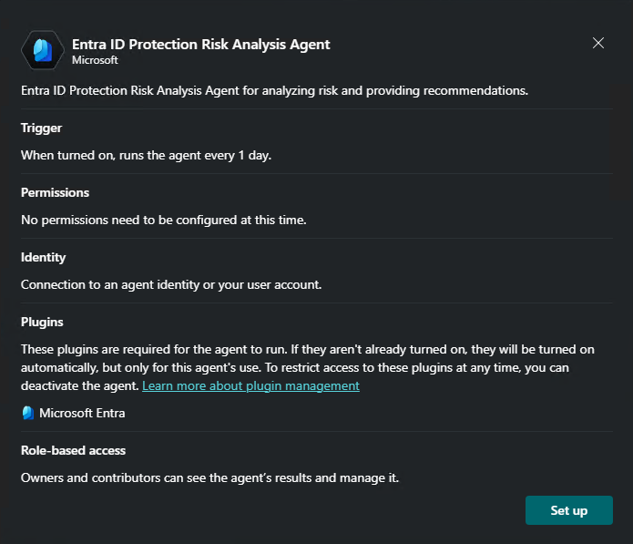

Create an agent

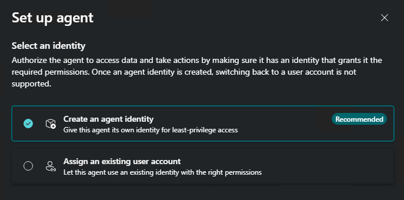

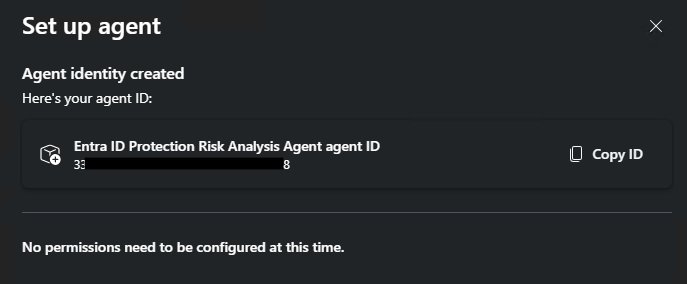

You can leave that empty. You will be able to modify them after.
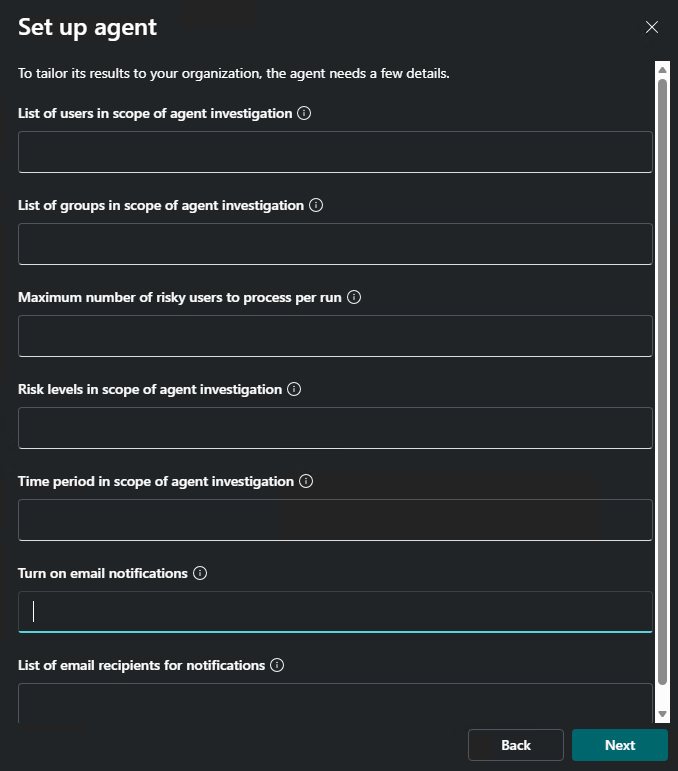

Then a summary will appear, so click on finish.

Here you are !!
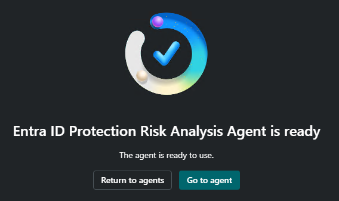

3.3. Access Review

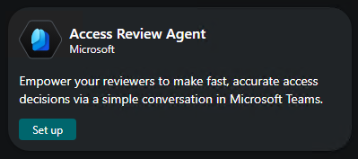

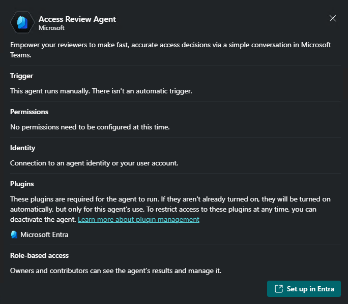

You will be redirected to Entra

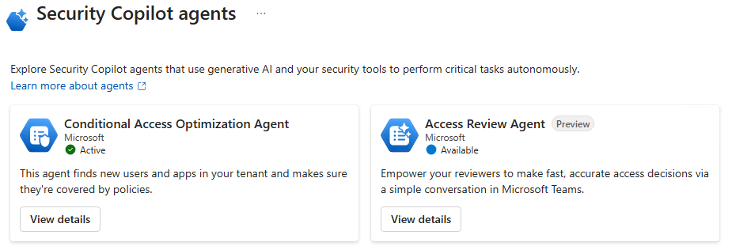

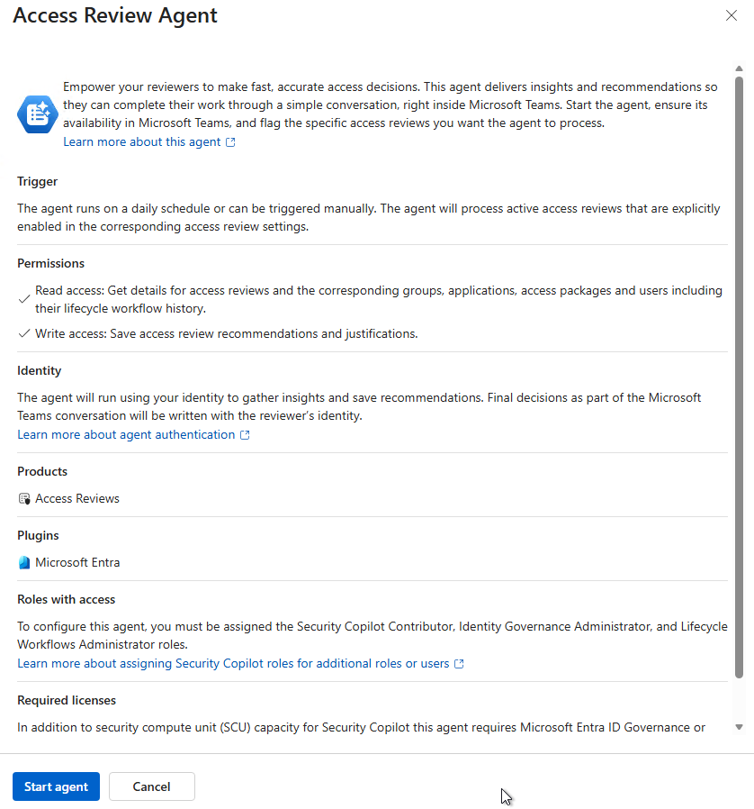

