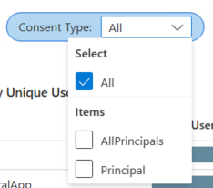
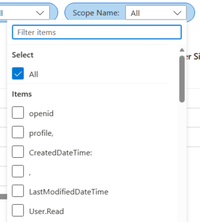
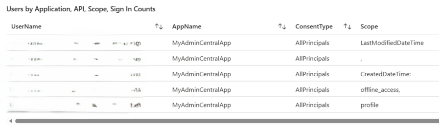
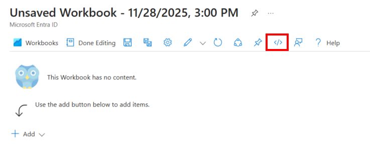
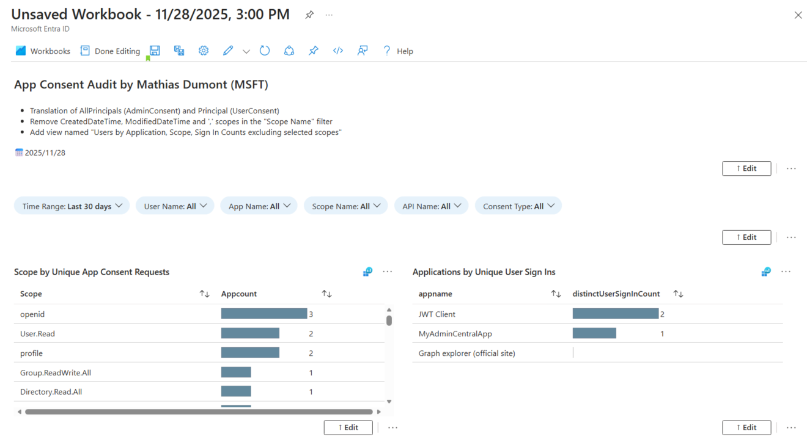
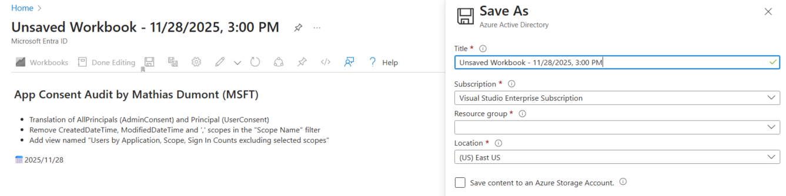
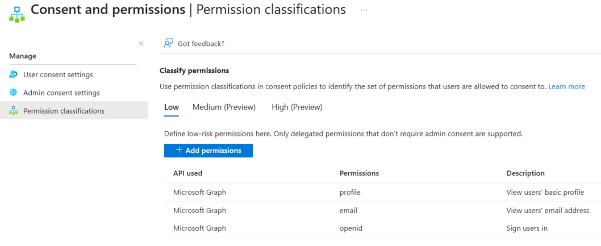
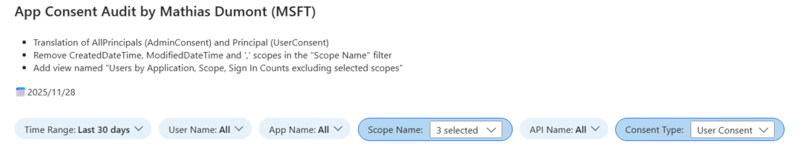
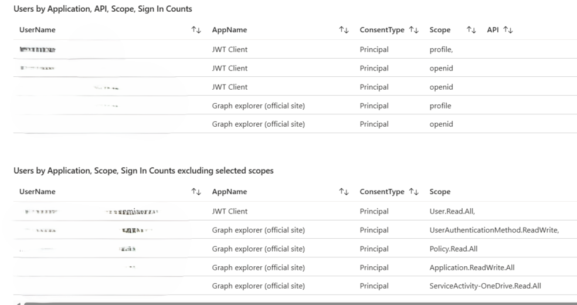

# App Consent

Microsoft provides a workbook named "App Consent Audit" which helps you to view and identify all consents during a specific period in your tenant.

In the default workbook, there is some improvement that are require.
- Consent Type filter: 
If you don't already know, **AllPrincipals** means **Admin Consent** and **Principal** means **User Consent**.

    

- Scope Name filter: 
The scope are not ordered by ascending, so you could take some times to search which scope you want to see and select.

    

- In this section, we see some irrelevant scope (",", CreatedDateTime, LastModifiedDateTime)

    

## New version
So, based on that, I created a new workbook.
1. Create a new workbook and use **Advanced Editor**.

    

2. Then, copy all datas from the json file named **App Consent.json** and replace the actual content.
3. Click on **Apply** on the right

    

4. Validate all things work as expected and save it.

    

## How to use it
### Scenario 1
I would like to define some low permissions to "User consent settings" and offer my users to consent. Before doing that, I would like to identify all used applications where those permissions have not been consented by an admin.

    

**Filter I used**
- Consent Type: User Consent (Principal)
- Scope Name: my permissions

    

We can see that apps are the same, so what does that mean ?
- If the user requests more permissions than defined, an admin consent is required
- Users can consent for these 3 permissions
- My 2 apps used during 30 days won't be impacted when I will change my consent settings

    

