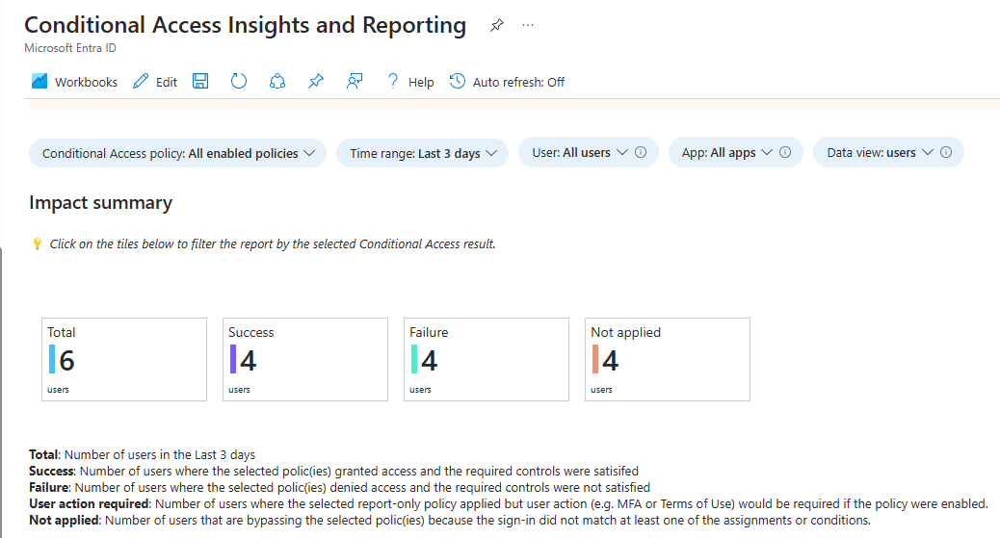
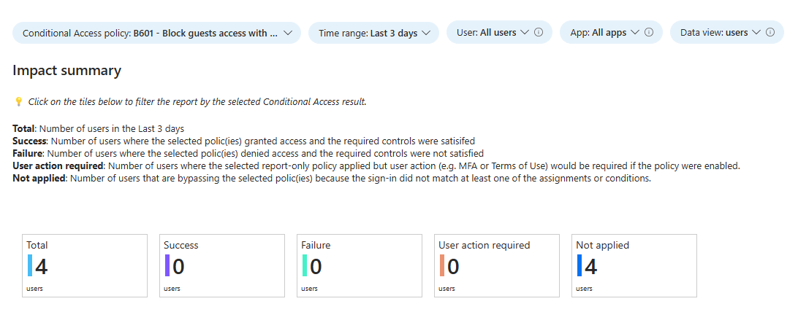
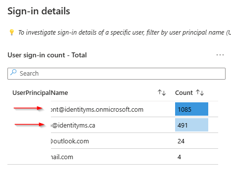
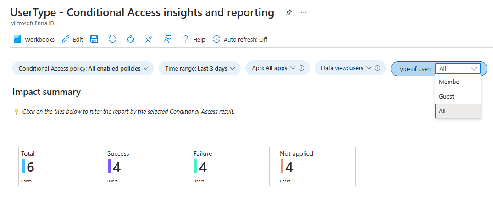
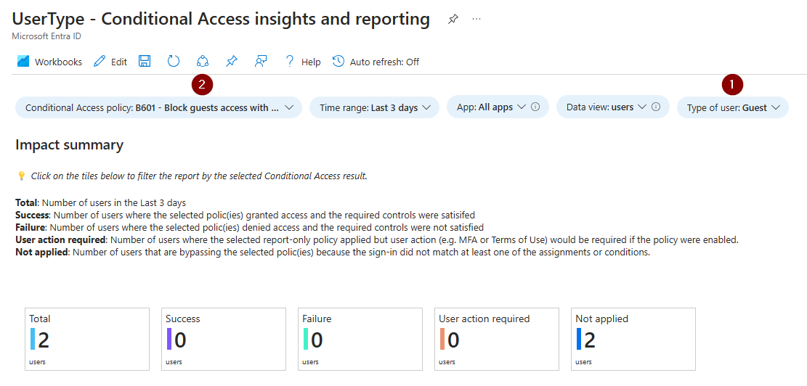
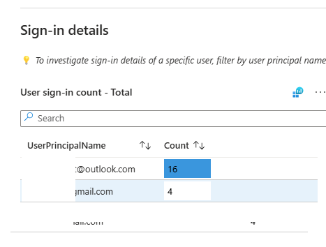

# New Conditional Access insights and reporting

As you probably know, we recommend to implement Zero Trust Conditional Access framework which is require Personas.
Guest account will be one of persona, so you will have some Conditional Access policies that targeting guest account.

Evenif you has not implemented ZT CAP, we recommend to create some CAP for guest account. For example, to disable persistence on browser, require MFA every 4h or 8 h or less 😊.

In the default workbook named Conditional Access Insight and Reporting, you can not select the type of identity. So, if you analyze the datas, you will see that information are not relevant.

    

I selected a CAP which target guest account

    

But these accounts are not a guest

    

So to address that, I created a new workbook and added a new filter name "Type of user"

Select what type of account you want to see:
- Member
- Guest
- All

    

If you select "Guest" and a CAP targeting guest accounts, all datas will be associated with the context that you selected.

    

    

