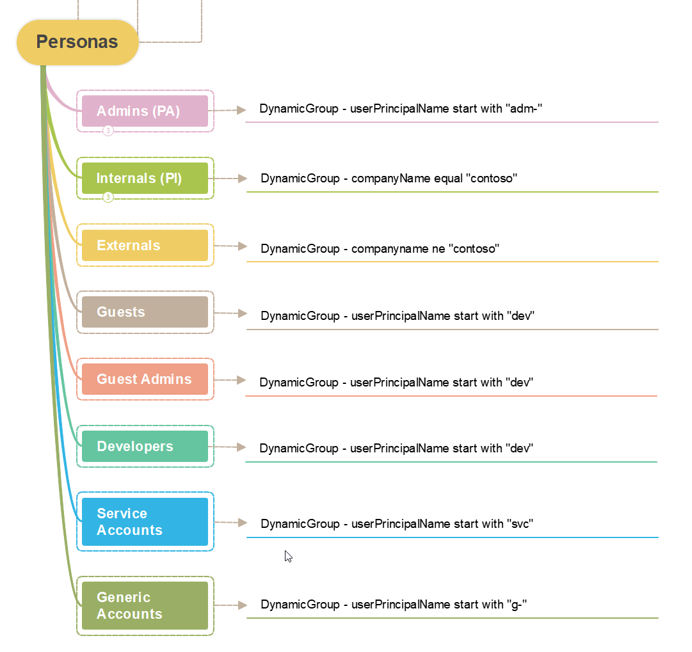
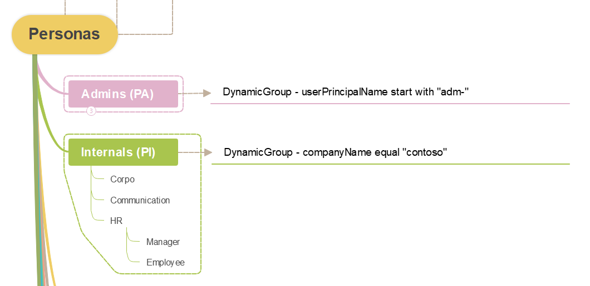

# Table of Contents
- [Introduction](#introduction)
- [Personas](#Personas)
    - [What is the definition](#what-is-the-definition)
    - [What is the utility of Personas in Zero Trust](#What-is-the-utility-of-Personas-in-Zero-Trust)
    - [Mind Map](#Mind-Map)
- [Conditional Access](#Conditional-Access)

# Introduction
In today’s digital landscape, security threats are more sophisticated and pervasive than ever. Traditional security models, which rely on perimeter defenses, are no longer sufficient to protect sensitive data and systems. This is where the concept of Zero Trust comes into play. Zero Trust is a security framework that operates on the principle of “never trust, always verify.” It requires continuous verification of user identities and strict access controls, regardless of whether the user is inside or outside the network.

Understanding the different personas within an organization is crucial for implementing an effective Zero Trust strategy. Personas represent the various roles and responsibilities of users, such as administrators, developers, and regular employees. By defining these personas, organizations can tailor their security policies to meet the specific needs and risks associated with each role. This approach not only enhances security but also ensures that users have the appropriate level of access to perform their duties efficiently.

In this article, we will explore the importance of Zero Trust and how defining personas can help organizations achieve a more secure and resilient security posture. Readers will gain insights into the practical application of Zero Trust principles and learn how to create and manage personas to strengthen their security framework.

In Microsoft documentation, a concept that already exist since many years, come back. Personas !!! But what does it mean ?
And before starting to build your rules, start with Personas.

# Personas
In the context of implementing Zero Trust for identity, a persona refers to a typical profile representing a category of users within an organization. This concept is essential to determine appropriate security policies and access levels for different groups of users based on their roles, responsibilities, and behaviors.

## What is the definition
A persona is generaly represented by a group of users sharing common characteristics. Lot of organisations know that, but start directly with line of business (trader, etc), type of role/job. They often forgot that all of them have a common point: they are employees.

You can have different level, but you should define the first level.

Here are some personas:
- Employees or internals: you have the same employer on your paid check.
- Externals or consultants: they are not directly paid by your organisation but they work for you. They need an account and/or a computer managed by your organisation.
- Guests: they need to collaborate with your organisation, but it's not required for them to use a corporate computer or having a corporate identity.
- Admins: administrators should have a specific account and some 
- Developers:
- Generic Account:
- Service Accounts:
This list is non-exaustive and you should define your own persona based on the common characteristics.

To help you designing your personas, use this guidance. Personas have common:
- Goals
- Behaviors
- Security needs
- Resource access

## What is the utility of Personas in Zero Trust
The Zero Trust approach is based on the principle that nothing should be trusted, whether inside or outside your network organization.

Personas help to:
- Define Access Policies: By determining the specific needs of each group, it is possible to create granular access policies based on identity.
- Implement Continuous Authentication: By monitoring typical behaviors of personas, systems can detect and respond to anomalies in real-time.
- Reduce Risks: By limiting access to only the necessary resources for each persona, the potential attack surface is minimized.
- Facilitate Access Management: Personas simplify the administration of access rights by allowing group-based rather than individual management.

## Mind Map

Your first level:

    

Your second level:

    

# Conditional Access

# Identity Governance (in progress)

# Purview (in progress)

